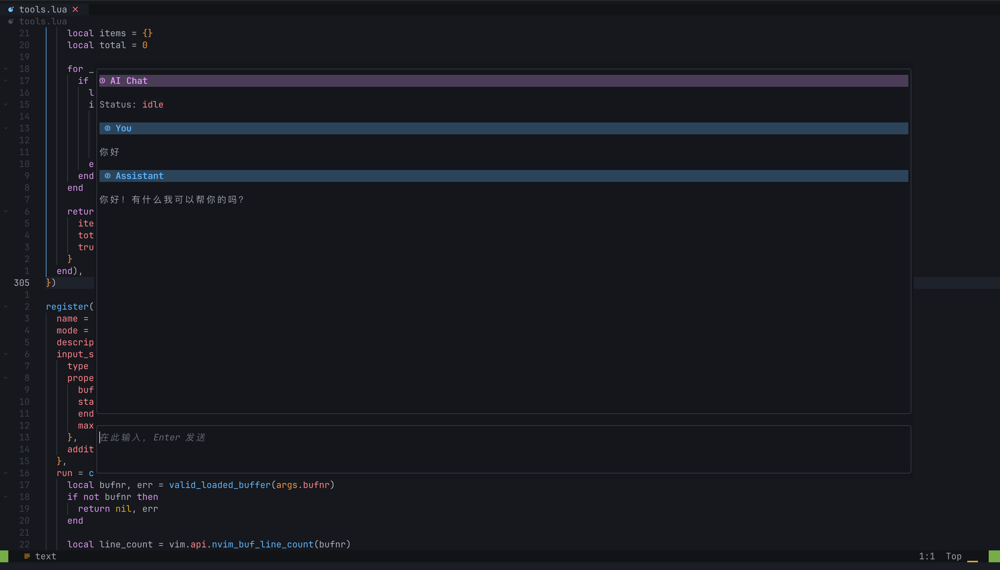

# ai.nvim


---



A small Neovim AI assistant built around editor operations:

- run prompts on a visual selection, paragraph, buffer, file, git diff, or project search context
- preview AI edits as a unified diff before applying them
- use diagnostics, symbol lookup, references, quickfix entries, git diff, and project rules as request context
- talk to OpenAI-compatible `/v1/chat/completions` endpoints through a pluggable provider transport (`curl` by default)

This is intentionally not just a chat panel. The useful path is:

```text
selection + intent -> diff preview -> confirm apply
diagnostic + context -> minimal patch guidance
git diff -> review / commit message
project grep -> answer with source context
```

## Install

With lazy.nvim:

```lua
local function ai_chat_toggle()
  if vim.fn.mode():match "^[iR]" then
    vim.cmd.stopinsert()
  end
  vim.cmd.AIChatToggle()
end

local function ai_pop_chat_toggle()
  if vim.fn.mode():match "^[iR]" then
    vim.cmd.stopinsert()
  end
  vim.cmd.AIPopChatToggle()
end

---@type LazySpec
return {
  {
    "uuhan/ai.nvim",
    lazy = false,
    dependencies = {
      {
        "MeanderingProgrammer/render-markdown.nvim",
        dependencies = { "nvim-treesitter/nvim-treesitter" },
        opts = {
          file_types = { "markdown" },
        },
      },
    },
    keys = {
      { "<C-/>", ai_chat_toggle, mode = { "n", "i" }, desc = "Toggle AI chat" },
      { "<C-_>", ai_chat_toggle, mode = { "n", "i" }, desc = "Toggle AI chat" },
      { "<C-\\>", ai_pop_chat_toggle, mode = { "n", "i" }, desc = "Toggle AI popup chat" },
    },
    opts = {
      system_prompt = "请使用中文回复对话。",
      provider = {
        base_url = os.getenv "AI_NVIM_BASE_URL" or "https://api.deepseek.com",
        api_key_env = os.getenv "AI_NVIM_API_KEY_ENV" or "DEEPSEEK_API_KEY",
        model = os.getenv "AI_NVIM_MODEL" or "deepseek-v4-flash",
        transport = "curl",
        stream = os.getenv "AI_NVIM_STREAM" ~= "0",
        thinking = os.getenv "AI_NVIM_THINKING" == "1",
        temperature = tonumber(os.getenv "AI_NVIM_TEMPERATURE" or "") or 0.2,
      },
      streaming = {
        interval_ms = 30,
        max_chars_per_flush = 96,
      },
      chat = {
        max_tool_rounds = tonumber(os.getenv "AI_NVIM_MAX_TOOL_ROUNDS" or "") or 20,
      },
    },
  },
}
```

## Commands

Core editing:

```vim
:AI {prompt}                 " ask about visual selection or current paragraph
:AIExplain                   " explain selected/current code
:AIFindBug                   " find concrete bugs in selected/current code
:AIEdit {instruction}        " generate replacement and preview diff
:AIRefactor                  " refactor selected/current code
:AIFix                       " fix selected/current code
:AITest                      " suggest tests for selected/current code
:AIApply                     " apply the latest AI edit preview
:AIReject                    " clear the latest AI edit preview
```

Read-only one-shot commands render their response in a focused floating Markdown
window. This includes `:AI`, `:AIExplain`, `:AIFindBug`, `:AITest`, `:AIBuffer`,
`:AISummarizeFile`, `:AISearchProject`, `:AIExplainDiff`, and
`:AICommitMessage`.
Press `q` or `<Esc>` to close it.

Buffer and project context:

```vim
:AIBuffer {prompt}
:AISummarizeFile
:AISearchProject {question}
```

Diagnostics and git:

```vim
:AIFixDiagnostic
:AIFixAllDiagnostics
:AIFixQuickfix
:AIReviewDiff
:AIExplainDiff
:AIFindBugInDiff
:AICommitMessage
```

Shell commands:

```vim
:AICmd {task}                " generate a shell command for review
:AIGit {task}                " generate a git command
:AIRun                       " run the latest generated command
```

Agent plan:

```vim
:AIAgent {task}              " create a reviewable plan
:AIPlan next                 " preview the next pending step
:AIPlan apply                " preview the next patch step
:AIPlan run                  " preview the next command/test step
:AIPlan done                 " mark the active step done
:AIPlan skip                 " skip the active step
:AIPlan show                 " show the active plan
:AIPlan reset                " clear the active plan
```

Chat:

```vim
:AIChat {message}            " open side chat; optional message sends immediately
:AIPopChat {message}         " open floating chat; optional message sends immediately
:AIChatToggle                " open or hide side chat
:AIPopChatToggle             " open or hide floating chat
:AIChatStop                  " stop the active chat request
:AIChatReset
```

Harness tools:

```vim
:AITools                     " show model-facing Neovim tool registry
:AITool {name} [json_args]   " run one tool manually
```

Configuration and rules:

```vim
:AIPing
:AIConfig
:AIRules
```

Project rule files are automatically included when present:

```text
.nvim/ai.md
.ai/rules.md
AGENTS.md
CLAUDE.md
codex.md
```

## Notes

- Edits are never applied automatically. Use `:AIApply` after inspecting the diff.
- AI-generated patches are never applied automatically. Use `:AIApply` after inspecting the patch.
- AI-generated shell commands are never executed automatically. Use `:AIRun` after inspecting the command.
- `:AISearchProject` uses `rg` when available. It does not maintain a vector database.
- `:AIReviewDiff` and related commands read `git diff`, `git diff --cached`, and
  `git status --short`.
- `:AIReviewDiff` and `:AIFindBugInDiff` parse `file:line` references from the
  AI response and place them in the location list when possible.
- `:AITools` exposes bounded Neovim context tools for the coding harness:
  editor state, buffers, files, selection, diagnostics, quickfix/location lists,
  symbol hover/definition/references, document/workspace symbols, code action
  listing, git diff, project files/search, patch/command preview, and
  buffer/file range replacement previews.
- Command execution has a small safety blocklist by default. Set
  `safety.allow_dangerous_commands = true` only if you want `:AIRun` to skip it.
- Set `provider.stream = true` to stream normal answers and AIChat text.
  Stream text is buffered with `streaming.interval_ms` and
  `streaming.max_chars_per_flush` so large provider chunks render with a smoother
  typewriter-like cadence. AIChat also supports streaming tool-call responses:
  text deltas are shown first, while tool-call arguments are buffered until the
  stream finishes and then dispatched. Patch and command preview requests stay
  non-streaming so the plugin can parse the complete result before previewing
  them.
- `provider.thinking` defaults to `false`. DeepSeek-compatible providers receive
  `thinking = { type = "disabled" }` by default; set `provider.thinking = true`
  to opt into thinking mode.
- `provider.transport` defaults to `"curl"`. You can pass a custom transport
  table with `request(req, cb)` and `stream(req, callbacks)` when you want to
  route requests through another HTTP client.
- `:AIAgent` generates a plan only. It does not apply patches or run commands.
  Use `:AIPlan apply` with `:AIApply`, or `:AIPlan run` with `:AIRun`, then
  `:AIPlan done` to advance the plan.
- `:AIPing` sends a tiny non-streaming request to the configured model and shows
  provider, model, elapsed time, and response.

AI output buffers are reused by default and expose local normal-mode keys:

```text
a apply pending edit or patch
r reject pending action
n preview next agent step
p preview next patch step
t preview next command/test step
d mark active plan step done
s skip active plan step
q close AI window
```

`:AIChat` opens a right-side chat panel. `:AIPopChat` opens the same chat in a
floating popup. The top pane shows the conversation, and the bottom pane is the
input area. Press `<CR>` or `<C-s>` in the input pane to send, `<C-c>` or
`:AIChatStop` to stop the active request, `<C-l>` to clear the chat, and
`<C-q>` or `q` to close the panel. The conversation pane shows a small status
line such as `thinking`, `running tool`, or `idle`. The empty input pane shows
configurable ghost text from `chat.placeholder`.

By default, AIChat can call the harness tools listed by `:AITools`. Providers
that support OpenAI-compatible `tools` receive native tool definitions; models
that emit text JSON tool calls still work as a fallback. Tool calls and tool
results are rendered as Markdown callouts in the conversation. Patch and command
tools only create previews; use `:AIApply` or `:AIRun` after inspection. Tool
results show a compact summary first, with details folded by default; use normal
Neovim fold keys such as `zo`, `zc`, and `za` to inspect or hide them. Full tool
output stays visible in the chat up to `chat.max_tool_result_chars`; the content
sent back to the model is compressed separately by `chat.max_tool_model_chars`.
When the chat input has focus, buffer-oriented tools still default to the last
real editor buffer rather than `ai://chat-input`; `nvim_editor_state` reports
both the actual focused buffer and the target editor buffer.
Language-aware tools serve code understanding directly: they expose hover text,
definitions, references, symbols, and code action titles without asking the
model to reason about language service internals.
One-shot commands such as `:AIExplain`, `:AIEdit`, `:AIFix`, `:AIRefactor`,
and `:AIFixDiagnostic` also collect a small amount of this semantic context
before sending their single model request.

Chat tool loop settings:

```lua
require("ai").setup({
  system_prompt = "请使用中文回复对话。",
  chat = {
    width = 80,
    input_height = 3,
    popup = {
      width = 0.82,
      height = 0.78,
      border = "rounded",
    },
    render_markdown = true,
    native_tools = true,
    tools_enabled = true,
    max_tool_rounds = 20,
    max_tool_model_chars = 6000,
    max_tool_result_chars = 20000,
    fold_tool_results = true,
  },
})
```

`system_prompt` is appended to ai.nvim's built-in editor-aware system prompt and
is used by both one-shot commands and `AIChat`.

AIChat uses `render-markdown.nvim` for Markdown rendering. Install the
`markdown` and `markdown_inline` Treesitter parsers for Markdown structure, and
the relevant language parser, for example `typescript`, for fenced code block
token highlighting.

The same tool registry is available from Lua:

```lua
local tools = require("ai").tools()
tools.run("nvim_current_buffer", {}, function(err, result)
  print(vim.inspect(result))
end)
```
