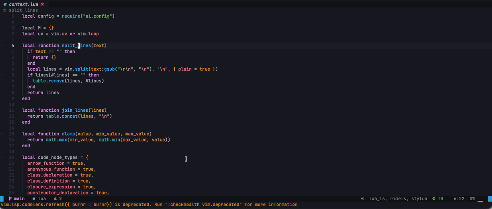
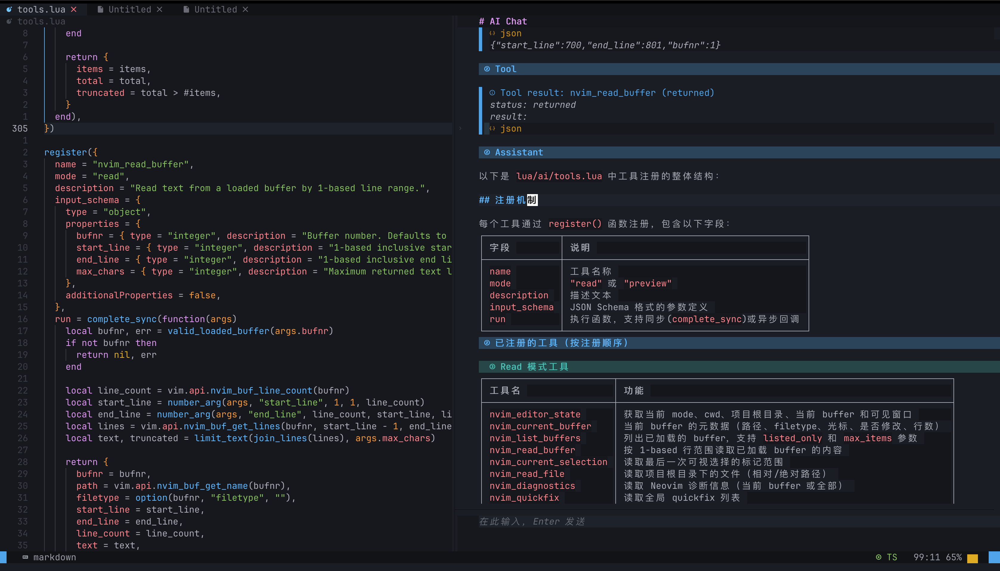

# ai.nvim - Your coding agent inside neovim.



---



---


A Neovim AI assistant built around editor operations:

- run prompts on a visual selection, paragraph, buffer, file, git diff, or project search context
- preview AI edits as a unified diff before applying them
- use diagnostics, symbol lookup, references, quickfix entries, git diff, and project rules as request context
- talk to OpenAI-compatible `/v1/chat/completions` endpoints through a pluggable provider transport (`curl` by default)

This is intentionally not just a chat panel. The useful path is:

```text
selection + intent -> diff preview -> confirm apply
diagnostic + context -> minimal patch guidance
git diff -> review / commit message
project grep -> answer with source context
```

## Install

With lazy.nvim:

```lua
local function ai_chat_toggle()
  if vim.fn.mode():match "^[iR]" then
    vim.cmd.stopinsert()
  end
  vim.cmd.AIChatToggle()
end

local function ai_pop_chat_toggle()
  if vim.fn.mode():match "^[iR]" then
    vim.cmd.stopinsert()
  end
  vim.cmd.AIPopChatToggle()
end

---@type LazySpec
return {
  {
    "uuhan/ai.nvim",
    lazy = false,
    dependencies = {
      {
        "MeanderingProgrammer/render-markdown.nvim",
        dependencies = { "nvim-treesitter/nvim-treesitter" },
        opts = {
          file_types = { "markdown" },
        },
      },
      -- Recommended: powers the compact :AIQuick status / tool-call / reply
      -- notifications. Optional — ai.nvim falls back to vim.notify if absent.
      { "j-hui/fidget.nvim", opts = {} },
    },
    keys = {
      { "<C-/>", ai_chat_toggle, mode = { "n", "i" }, desc = "Toggle AI chat" },
      { "<C-_>", ai_chat_toggle, mode = { "n", "i" }, desc = "Toggle AI chat" },
      { "<C-\\>", ai_pop_chat_toggle, mode = { "n", "i" }, desc = "Toggle AI popup chat" },
      -- :AIQuick is bound to <leader>aq automatically (configure via quick.keymap).
    },
    opts = {
      system_prompt = "请使用中文回复对话。",
      provider = {
        base_url = os.getenv "AI_NVIM_BASE_URL" or "https://api.deepseek.com",
        api_key_env = os.getenv "AI_NVIM_API_KEY_ENV" or "DEEPSEEK_API_KEY",
        model = os.getenv "AI_NVIM_MODEL" or "deepseek-v4-flash",
        transport = "curl",
        stream = os.getenv "AI_NVIM_STREAM" ~= "0",
        thinking = os.getenv "AI_NVIM_THINKING" == "1",
        temperature = tonumber(os.getenv "AI_NVIM_TEMPERATURE" or "") or 0.2,
      },
      streaming = {
        interval_ms = 30,
        max_chars_per_flush = 96,
      },
      chat = {
        max_tool_rounds = tonumber(os.getenv "AI_NVIM_MAX_TOOL_ROUNDS" or "") or 20,
      },
      safety = {
        auto_apply_edits = false,
        auto_write_edits = false,
        auto_run_commands = false,
      },
    },
  },
}
```

## Commands

Core editing:

```vim
:AI {prompt}                 " ask about visual selection or current paragraph
:AIExplain                   " explain selected/current code
:AIFindBug                   " find concrete bugs in selected/current code
:AIFixBug                    " generate a concrete bug-fix preview
:AIImplement {request}       " implement a feature as a patch preview
:AIEdit {instruction}        " generate replacement and preview diff
:AIComment [instruction]     " add useful comments and preview diff
:AIRefactor                  " refactor selected/current code
:AIFix                       " fix selected/current code
:AITest                      " suggest tests for selected/current code
:AIApply                     " apply the latest AI edit preview
:AIReject                    " clear the latest AI edit preview
```

Read-only one-shot commands render their response in a floating Markdown result
session. This includes `:AI`, `:AIExplain`, `:AIFindBug`, `:AITest`,
`:AIBuffer`, `:AISummarizeFile`, `:AISearchProject`, `:AIReviewDiff`,
`:AIExplainDiff`, `:AIFindBugInDiff`, and `:AICommitMessage`.
The bottom input lets you continue the same request as a lightweight follow-up
conversation, so you can challenge a finding or ask for clarification without
recollecting context. The response pane keeps focus in normal mode; press `i`
to focus the follow-up input. Press `q`, `<Esc>`, or `<C-q>` to close it.

`:AIComment` accepts an optional instruction. Without one, it uses the default
commenting policy; with one, the text is treated as an extra requirement while
the default "do not change behavior" constraints remain in force.

Buffer and project context:

```vim
:AIBuffer {prompt}
:AISummarizeFile
:AISearchProject {question}
```

Diagnostics and git:

```vim
:AIFixDiagnostic
:AIFixAllDiagnostics
:AIFixQuickfix
:AIReviewDiff
:AIExplainDiff
:AIFindBugInDiff
:AICommitMessage             " generate a commit message (shown only, no commit)
:AICommit                    " write a message from all changes (incl. new files)
                             " and preview `git add -A && git commit`; a commit, r reject
```

Shell commands:

```vim
:AICmd {task}                " generate a shell command for review
:AIRun                       " run the latest generated command
```

Agent plan:

```vim
:AIAgent {task}              " create a reviewable plan
:AIPlan next                 " preview the next pending step
:AIPlan apply                " preview the next patch step
:AIPlan run                  " preview the next command/test step
:AIPlan done                 " mark the active step done
:AIPlan skip                 " skip the active step
:AIPlan show                 " show the active plan
:AIPlan reset                " clear the active plan
```

Chat:

```vim
:AIChat {message}            " open side chat; optional message sends immediately
:'<,'>AIChat [message]       " share the selection with the chat; with a message it sends immediately
:AIPopChat {message}         " open floating chat; optional message sends immediately
:AIQuick [message]           " prompt for a short agent task and report progress via notifications
:AIChatToggle                " open or hide side chat
:AIPopChatToggle             " open or hide floating chat
:AIChatStop                  " stop the active chat request
:AIChatReset
:AIChatResume                " restore the most recent saved session
:AIChatSessions              " pick a saved session to restore
```

Harness tools:

```vim
:AITools                     " show model-facing Neovim tool registry
:AITool {name} [json_args]   " run one tool manually
```

Configuration and rules:

```vim
:AIPing
:AIConfig
:AIRules
```

Project rule files are automatically included when present:

```text
.nvim/ai.md
.ai/rules.md
AGENTS.md
CLAUDE.md
codex.md
```

## Notes

- Edits and AI-generated patches create previews by default. Use `:AIApply`
  after inspecting the diff, or `:AIReject` to discard it.
- Set `safety.auto_apply_edits = true` only if you want edit and patch previews
  to apply immediately after they are generated.
- Applied edits and patches modify buffers only. Set
  `safety.auto_write_edits = true` to also write the modified buffers to disk
  after a successful apply, which keeps follow-up commands such as test runs in
  sync with the edits. Apply results always report the disk state.
- When a preview was created by an AIChat tool call, `:AIApply` feeds the apply
  result back into the chat and continues the conversation, so the model can
  move on to the next step. `:AIReject` records the rejection as an editor
  event that the model sees on your next message.
- Only one preview (edit, patch, or command) can be pending at a time. When a
  chat tool call creates a new preview, the tool result notes that any
  unapplied previous preview was discarded.
- Chat history is persisted per project as append-only JSONL files under
  `stdpath("state")/ai.nvim/sessions` (plaintext on disk; set
  `chat.sessions.enabled = false` to opt out, or `chat.sessions.dir` to move
  it). `:AIChatReset` keeps the old session and starts a new file. Restore with
  `:AIChatResume` (latest) or `:AIChatSessions` (picker); restored sessions
  keep appending to the same file. Set `chat.sessions.resume = "latest"` to
  restore automatically when the chat opens. The newest
  `chat.sessions.keep` sessions are retained per project.
- Long conversations stay lean: only the most recent
  `chat.max_full_tool_results` tool results are sent to the model in full;
  older ones collapse to their one-line summary. The visible chat rendering is
  unaffected.
- AI-generated shell commands create previews by default. The preview shows a
  top-of-window hint; press `a` to run (or `:AIRun`) and `r` to reject (or
  `:AIReject`) after inspecting the command, or set `safety.auto_run_commands =
  true` to let command preview tools run immediately after the safety blocklist
  check. Command results are reported via a notification (success or error)
  rather than a separate output window.
- `:AIQuick` opens a small input popup anchored at the cursor (`quick.input =
  "float"`, the default): it starts in insert mode, submits on `<CR>`, and
  closes on `<Esc>` or focus loss. Set `quick.input = "native"` to use
  `vim.ui.input` instead (so a UI plugin such as snacks.nvim or dressing.nvim
  can render it). Progress is reported through `fidget.nvim` when available
  (compact status, tool-call, and short reply notifications), falling back to
  `vim.notify` otherwise; long replies open in the existing AI popup. It is
  bound to `<leader>aq` by default (normal mode prompts for a task; visual mode
  shares the selection as context); set `quick.keymap` to another lhs or
  `false` to change or disable it.
- `:AISearchProject` uses `rg` when available. It does not maintain a vector
  database. Search terms are extracted from the question with stopword
  filtering and identifier-aware ranking, and up to three distinctive terms are
  searched.
- `:AIReviewDiff` and related commands read `git diff`, `git diff --cached`, and
  `git status --short`.
- `:AIReviewDiff` and `:AIFindBugInDiff` parse `file:line` references from the
  AI response and place them in the location list when possible.
- `:AITools` exposes bounded Neovim context tools for the coding harness:
  editor state, buffers, files, selection, diagnostics, quickfix/location lists,
  symbol hover/definition/references, document/workspace symbols, code action
  listing, git diff, project files/search, structured `nvim_grep`/`nvim_glob`
  search, patch/command preview, buffer/file range replacement previews,
  exact-string file edits (`nvim_edit_file`), and new-file previews
  (`nvim_create_file`). Buffer and file read tools prefix each line with its
  line number so the model can reference exact ranges.
- `nvim_edit_file` replaces exactly one occurrence of `old_string` with
  `new_string`; ambiguous or missing matches return errors that guide the
  model to add context, which is far more robust for LLMs than line-number
  arithmetic or hand-built diffs.
- When the chat tool loop hits `chat.max_tool_rounds`, the conversation is no
  longer discarded: the model gets one final tool-free round to answer with
  what it has gathered.
- The API key is passed to curl through a private config file (`-K`), not
  argv, so it does not show up in the process list.
- `:AIFixBug` uses the same reviewable replacement-preview path as `:AIEdit`.
- `:AIImplement` collects current editor context, diagnostics, language context,
  and relevant project search context, then creates a unified diff preview.
- Command execution has a small safety blocklist by default. Set
  `safety.allow_dangerous_commands = true` only if you want `:AIRun` to skip it.
- Set `provider.stream = true` to stream normal answers and AIChat text.
  Stream text is buffered with `streaming.interval_ms` and
  `streaming.max_chars_per_flush` so large provider chunks render with a smoother
  typewriter-like cadence. AIChat also supports streaming tool-call responses:
  text deltas are shown first, while tool-call arguments are buffered until the
  stream finishes and then dispatched. Patch and command preview requests stay
  non-streaming so the plugin can parse the complete result before previewing
  them.
- `provider.thinking` defaults to `false`. DeepSeek-compatible providers receive
  `thinking = { type = "disabled" }` by default; set `provider.thinking = true`
  to opt into thinking mode.
- `provider.transport` defaults to `"curl"`. You can pass a custom transport
  table with `request(req, cb)` and `stream(req, callbacks)` when you want to
  route requests through another HTTP client.
- `:AIAgent` generates a plan only. It does not apply patches or run commands.
  Use `:AIPlan apply` with `:AIApply`, or `:AIPlan run` with `:AIRun`, then
  `:AIPlan done` to advance the plan.
- `:AIPing` sends a tiny non-streaming request to the configured model and shows
  provider, model, elapsed time, and response.

AI output buffers are reused by default and expose local normal-mode keys:

```text
a accept pending action (apply edit/patch, or run a command like :AICommit)
r reject pending action
n preview next agent step
p preview next patch step
t preview next command/test step
d mark active plan step done
s skip active plan step
q close AI window
```

`:AIChat` opens a right-side chat panel. `:AIPopChat` opens the same chat in a
floating popup. The top pane shows the conversation, and the bottom pane is the
input area. The conversation pane keeps focus in normal mode; press `i` or
`<CR>` there to focus the input. Press `<CR>` or `<C-s>` in the input pane to
send, `<S-CR>` or `<C-j>` to insert a line break, `<C-c>` or
`:AIChatStop` to stop the active request, `<C-l>` to clear the chat, and
`<C-q>` or `q` to close the panel. With a visual range, `:'<,'>AIChat` shares
the selection with the conversation; without a message it is recorded as
context for your next question. While a response streams in, the view follows
the output only if the cursor is at the bottom of the conversation pane, so
you can scroll up and read without being yanked back down. The conversation pane shows a small status
line such as `thinking`, `running tool`, or `idle`. The empty input pane shows
configurable ghost text from `chat.placeholder`.

By default, AIChat can call the harness tools listed by `:AITools`. Providers
that support OpenAI-compatible `tools` receive native tool definitions; models
that emit text JSON tool calls still work as a fallback. Tool calls and tool
results are rendered as Markdown callouts in the conversation. Patch and command
tools create previews by default; use `:AIApply` or `:AIRun` after inspection.
When `safety.auto_run_commands = true`, command preview tools execute
immediately after the safety blocklist check and return command output to the
model. Tool
results show a compact summary first, with details folded by default; use normal
Neovim fold keys such as `zo`, `zc`, and `za` to inspect or hide them. Full tool
output stays visible in the chat up to `chat.max_tool_result_chars`; the content
sent back to the model is compressed separately by `chat.max_tool_model_chars`.
When the chat input has focus, buffer-oriented tools still default to the last
real editor buffer rather than `ai://chat-input`; `nvim_editor_state` reports
both the actual focused buffer and the target editor buffer.
`nvim_open_file` can open an existing project file in the current editor window,
split, vertical split, or tab, and then make that file the target editor buffer
for later tools.
Language-aware tools serve code understanding directly: they expose hover text,
definitions, references, symbols, and code action titles without asking the
model to reason about language service internals.
One-shot commands such as `:AIExplain`, `:AIEdit`, `:AIFix`, `:AIRefactor`,
and `:AIFixDiagnostic` also collect a small amount of this semantic context
before sending their single model request.

Chat tool loop settings:

```lua
require("ai").setup({
  system_prompt = "请使用中文回复对话。",
  chat = {
    width = 80,
    input_height = 3,
    popup = {
      width = 0.82,
      height = 0.78,
      border = "rounded",
    },
    render_markdown = true,
    native_tools = true,
    tools_enabled = true,
    max_tool_rounds = 20,
    max_tool_model_chars = 6000,
    max_tool_result_chars = 20000,
    max_full_tool_results = 4,
    fold_tool_results = true,
    sessions = {
      enabled = true,
      -- dir defaults to stdpath("state") .. "/ai.nvim/sessions"
      resume = "manual", -- "latest" restores the last session when chat opens
      keep = 20,
    },
  },
  safety = {
    auto_apply_edits = false,
    auto_write_edits = false,
    auto_run_commands = false,
  },
})
```

`system_prompt` is appended to ai.nvim's built-in editor-aware system prompt and
is used by both one-shot commands and `AIChat`.

AIChat uses `render-markdown.nvim` for Markdown rendering. It renders Markdown
structure such as headings, lists, and fenced code block layout; syntax
highlighting inside fenced blocks is provided by Treesitter. Install the
`markdown` and `markdown_inline` parsers for Markdown structure, plus each
language parser you want highlighted. For example, Rust code blocks need:

```vim
:TSInstall markdown markdown_inline rust
```

If the parsers are already installed, update them with:

```vim
:TSUpdate markdown markdown_inline rust
```

The same tool registry is available from Lua:

```lua
local tools = require("ai").tools()
tools.run("nvim_current_buffer", {}, function(err, result)
  print(vim.inspect(result))
end)
```
